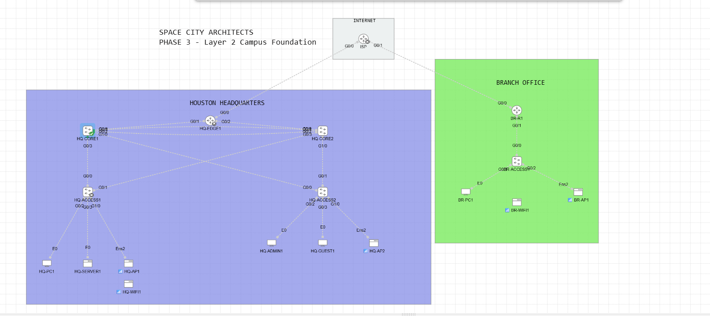

# Space City Architects — Enterprise Network Lab



## Project overview

This repository documents the design and staged implementation of a realistic two-site enterprise network for **Space City Architects**, a fictional architecture, engineering, and construction (AEC) firm. The lab is built in **Cisco Modeling Labs (CML) 2.10** and models a Houston headquarters, a branch office, internet/WAN connectivity, wired users, servers, guest devices, and wireless access.

The project is intentionally divided into phases so that the physical and logical design, configuration, validation, and troubleshooting can be reviewed independently.

## Business requirements

- Provide resilient connectivity at Houston headquarters.
- Support corporate, server, administration, guest, and wireless endpoints.
- Connect the headquarters and branch through a simulated service provider.
- Use enterprise features such as VLANs, trunks, EtherChannel, first-hop redundancy, dynamic routing, DHCP, NAT, and access control in later phases.
- Produce documentation that another engineer could use to reproduce, validate, and troubleshoot the lab.

## Architecture highlights

- Two IOSvL2 core switches at headquarters.
- Two dual-homed IOSvL2 access switches at headquarters.
- Two core links designed as one LACP EtherChannel.
- Separate IOSv routers for the ISP, headquarters edge, and branch edge.
- A branch IOSvL2 access switch with wired and wireless endpoints.
- Native CML Wireless AP and Wireless Client nodes for wireless testing.
- GigabitEthernet interfaces on all routed and switched infrastructure links.

> CML host nodes retain their native interface names (`E0` for Desktop/Server nodes and `ens2` for Wireless AP nodes). Those names are correct for the selected node definitions and should not be renamed to GigabitEthernet.

## Lab inventory

| Site | Role | Nodes | CML node type |
| --- | --- | --- | --- |
| Internet/WAN | Service provider | `ISP` | IOSv |
| Houston HQ | WAN edge | `HQ-EDGE1` | IOSv |
| Houston HQ | Core | `HQ-CORE1`, `HQ-CORE2` | IOSvL2 |
| Houston HQ | Access | `HQ-ACCESS1`, `HQ-ACCESS2` | IOSvL2 |
| Houston HQ | Endpoints | `HQ-PC1`, `HQ-SERVER1`, `HQ-ADMIN1`, `HQ-GUEST1` | Desktop / Server |
| Houston HQ | Wireless | `HQ-AP1`, `HQ-AP2`, `HQ-WIFI1` | Wireless AP / Wireless Client |
| Branch | Router and access | `BR-R1`, `BR-ACCESS1` | IOSv / IOSvL2 |
| Branch | Endpoints | `BR-PC1`, `BR-AP1`, `BR-WIFI1` | Desktop / Wireless AP / Wireless Client |

## Project roadmap

| Phase | Scope | Status |
| --- | --- | --- |
| 1 | Topology, node selection, Gigabit interface allocation, and cabling documentation | Complete |
| 2 | Enterprise device initialization, hostnames, secure local access, SSH, and configuration standards | Complete |
| 3 | VLANs, management addressing, 802.1Q trunks, LACP EtherChannel, and spanning-tree tuning | In progress |
| 4 | Inter-VLAN routing, HSRP, WAN addressing, and OSPF | Planned |
| 5 | DHCP, NAT/PAT, ACLs, and wireless services | Planned |
| 6 | End-to-end validation, failure testing, hardening, and final documentation | Planned |

## Phase 1 deliverables

- [Phase 1 Method of Procedure](docs/phase-1-mop.md)
- [Clean topology diagram](docs/images/phase-1-topology.png)
- [Interface-labeled cabling diagram](docs/images/phase-1-interface-map.png)
- [CML export guidance](lab/README.md)

Phase 1 is a design and cabling milestone only. The nodes were not started and no Cisco IOS configuration commands were entered during this phase.

## Phase 2 deliverables

- [Phase 2 Method of Procedure](docs/phase-2-mop.md)
- [Phase 2 milestone topology](docs/images/phase-2-topology.png)
- [HQ edge administrative-access verification](docs/images/phase-2-hq-edge1-access-verification.png)
- [HQ edge SSH and login-control verification](docs/images/phase-2-hq-edge1-ssh-verification.png)

Phase 2 established a repeatable administrative baseline on the seven Space City Architects-managed routers and switches. The simulated `ISP` remains outside the enterprise administrative boundary.

## Phase 3 checkpoint

- [Phase 3 Method of Procedure](docs/phase-3-mop.md)
- [Phase 3 topology and interface map](docs/images/phase-3-topology.png)
- [HQ-CORE1 VLAN verification](docs/images/phase-3-hq-core1-vlans.png)
- [HQ-CORE1 LACP checkpoint](docs/images/phase-3-hq-core1-etherchannel-pending.png)
- [HQ-CORE1 port-channel verification](docs/images/phase-3-hq-core1-port-channel.png)
- [HQ-CORE1 management SVI verification](docs/images/phase-3-hq-core1-management-svi.png)

Phase 3 is in progress. The logical design is approved and `HQ-CORE1` has been configured and saved. The second core, access switches, branch devices, end-to-end management testing, final configuration extraction, and completion evidence remain pending.

## Repository structure

```text
space-city-architects-network-lab/
├── README.md
├── docs/
│   ├── phase-1-mop.md
│   ├── phase-2-mop.md
│   ├── phase-3-mop.md
│   └── images/
│       ├── phase-1-*.png
│       ├── phase-2-*.png
│       └── phase-3-*.png
└── lab/
    └── README.md
```

## Skills demonstrated

- Translating business requirements into a layered network design.
- Selecting appropriate Cisco CML node types.
- Planning redundant uplinks and LACP EtherChannel.
- Designing VLAN segmentation and summarizable site addressing.
- Configuring static 802.1Q trunks and allowed VLAN lists.
- Assigning deterministic Rapid PVST+ root roles.
- Maintaining a deterministic interface map.
- Separating implementation into controlled, reviewable phases.
- Producing reproducible technical documentation and validation criteria.

## Disclaimer

Space City Architects is a fictional organization created for this lab. Cisco CML virtual interface names and forwarding performance model control-plane behavior; they are not claims of physical appliance throughput.
