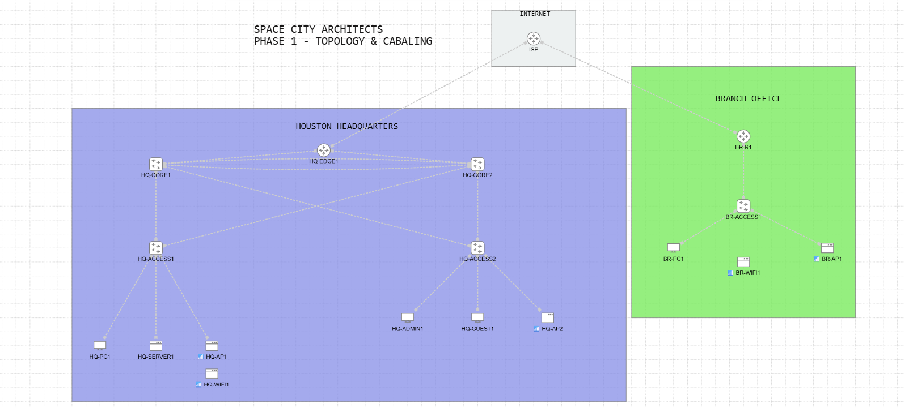
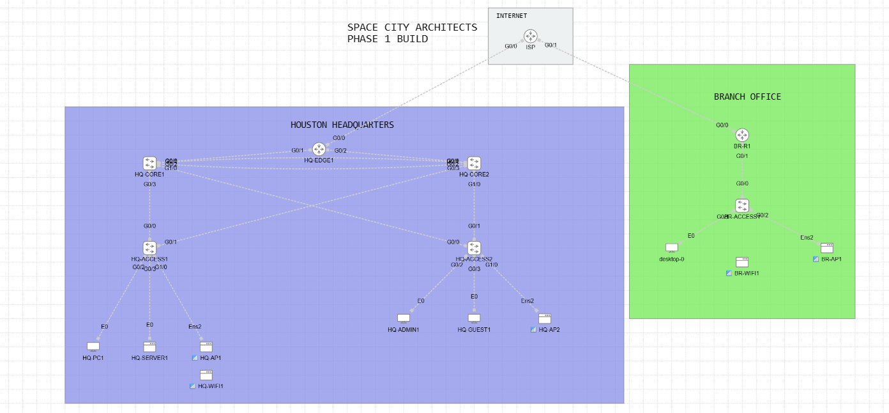

# Phase 1 MOP — Topology and Cabling

| Field | Value |
| --- | --- |
| Project | Space City Architects Enterprise Network Lab |
| Document ID | SCA-CML-P1-001 |
| Platform | Cisco Modeling Labs 2.10 |
| Phase | 1 — Topology and Cabling |
| Status | Complete |
| Completion date | August 16, 2026 |
| Change type | Lab build; no production impact |

## 1. Purpose

This Method of Procedure (MOP) records how the Phase 1 Cisco CML topology was created and cabled. It provides an exact interface map so another engineer can reproduce the physical layout before configuration begins.

## 2. Scope

### In scope

- Create the Houston headquarters, branch office, and internet/WAN zones.
- Add the required routers, Layer 2 switches, wired endpoints, server, wireless access points, and wireless clients.
- Allocate GigabitEthernet ports on routed and switched infrastructure.
- Cable every wired link according to the approved interface map.
- Place wireless clients next to their intended access points.
- Capture clean and interface-labeled screenshots.

### Out of scope

- Starting nodes.
- IOS or Linux CLI configuration.
- IP addressing, VLANs, trunks, EtherChannel, spanning tree, HSRP, OSPF, DHCP, NAT, ACLs, or SSIDs.
- End-to-end traffic testing.

These items begin in later project phases.

## 3. Design decisions

1. **IOSv routers** are used for `ISP`, `HQ-EDGE1`, and `BR-R1` because the lab will later require routed WAN links, NAT, ACLs, and dynamic routing.
2. **IOSvL2 switches** are used for all core and access roles because they support VLANs, 802.1Q trunks, STP, LACP, switched virtual interfaces, and other campus features needed later.
3. **GigabitEthernet infrastructure ports** are used throughout the routed and switched topology. Endpoint interfaces keep the names defined by their CML node type: `E0` for Desktop/Server and `ens2` for Wireless AP.
4. **HQ access switches are dual-homed** to both core switches to provide alternate paths for later failure testing.
5. **Two core-to-core links** are reserved for a future LACP port-channel. They are documented physically in Phase 1 and will be configured as one logical link in Phase 3.
6. **Wireless Client nodes are not cabled.** Their radio association, SSID, security, and client addressing will be configured in the wireless phase.

> Safety note: keep the lab nodes stopped until the Layer 2 design is configured. The two parallel core links must not be treated as independent forwarding links; Phase 3 will bundle them with LACP and verify spanning-tree state.

## 4. Node inventory

| Node | Site | Role | CML node type |
| --- | --- | --- | --- |
| `ISP` | Internet/WAN | Simulated service provider | IOSv |
| `HQ-EDGE1` | Houston HQ | WAN edge router | IOSv |
| `HQ-CORE1` | Houston HQ | Core switch 1 | IOSvL2 |
| `HQ-CORE2` | Houston HQ | Core switch 2 | IOSvL2 |
| `HQ-ACCESS1` | Houston HQ | Access switch 1 | IOSvL2 |
| `HQ-ACCESS2` | Houston HQ | Access switch 2 | IOSvL2 |
| `HQ-PC1` | Houston HQ | Corporate wired client | Desktop |
| `HQ-SERVER1` | Houston HQ | Application/server endpoint | Server |
| `HQ-ADMIN1` | Houston HQ | Administrative wired client | Desktop |
| `HQ-GUEST1` | Houston HQ | Guest wired test client | Desktop |
| `HQ-AP1` | Houston HQ | Wireless access point 1 | Wireless AP |
| `HQ-AP2` | Houston HQ | Wireless access point 2 | Wireless AP |
| `HQ-WIFI1` | Houston HQ | Wireless test client | Wireless Client |
| `BR-R1` | Branch | Branch WAN router | IOSv |
| `BR-ACCESS1` | Branch | Branch access switch | IOSvL2 |
| `BR-PC1` | Branch | Corporate wired client | Desktop |
| `BR-AP1` | Branch | Wireless access point | Wireless AP |
| `BR-WIFI1` | Branch | Wireless test client | Wireless Client |

## 5. Interface mapping

`G0/0` is the abbreviated CML diagram label for `GigabitEthernet0/0`.

### 5.1 Internet and WAN edge

| Link | A-side device | A-side interface | B-side device | B-side interface | Purpose |
| ---: | --- | --- | --- | --- | --- |
| 01 | `ISP` | `G0/0` | `HQ-EDGE1` | `G0/0` | HQ internet/WAN handoff |
| 02 | `ISP` | `G0/1` | `BR-R1` | `G0/0` | Branch internet/WAN handoff |

### 5.2 Houston edge, core, and access

| Link | A-side device | A-side interface | B-side device | B-side interface | Purpose |
| ---: | --- | --- | --- | --- | --- |
| 03 | `HQ-EDGE1` | `G0/1` | `HQ-CORE1` | `G0/0` | Edge-to-core routed link |
| 04 | `HQ-EDGE1` | `G0/2` | `HQ-CORE2` | `G0/0` | Edge-to-core routed link |
| 05 | `HQ-CORE1` | `G0/1` | `HQ-CORE2` | `G0/1` | Future LACP port-channel member 1 |
| 06 | `HQ-CORE1` | `G0/2` | `HQ-CORE2` | `G0/2` | Future LACP port-channel member 2 |
| 07 | `HQ-CORE1` | `G0/3` | `HQ-ACCESS1` | `G0/0` | Access-switch uplink |
| 08 | `HQ-CORE2` | `G0/3` | `HQ-ACCESS1` | `G0/1` | Redundant access-switch uplink |
| 09 | `HQ-CORE1` | `G1/0` | `HQ-ACCESS2` | `G0/0` | Access-switch uplink |
| 10 | `HQ-CORE2` | `G1/0` | `HQ-ACCESS2` | `G0/1` | Redundant access-switch uplink |

### 5.3 Houston endpoints and access points

| Link | Switch | Switch interface | Endpoint | Endpoint interface | Purpose |
| ---: | --- | --- | --- | --- | --- |
| 11 | `HQ-ACCESS1` | `G0/2` | `HQ-PC1` | `E0` | Corporate wired client |
| 12 | `HQ-ACCESS1` | `G0/3` | `HQ-SERVER1` | `E0` | Server access link |
| 13 | `HQ-ACCESS1` | `G1/0` | `HQ-AP1` | `ens2` | AP wired uplink |
| 14 | `HQ-ACCESS2` | `G0/2` | `HQ-ADMIN1` | `E0` | Administrative wired client |
| 15 | `HQ-ACCESS2` | `G0/3` | `HQ-GUEST1` | `E0` | Guest wired test client |
| 16 | `HQ-ACCESS2` | `G1/0` | `HQ-AP2` | `ens2` | AP wired uplink |

### 5.4 Branch office

| Link | A-side device | A-side interface | B-side device | B-side interface | Purpose |
| ---: | --- | --- | --- | --- | --- |
| 17 | `BR-R1` | `G0/1` | `BR-ACCESS1` | `G0/0` | Branch router-to-switch link |
| 18 | `BR-ACCESS1` | `G0/1` | `BR-PC1` | `E0` | Branch corporate client |
| 19 | `BR-ACCESS1` | `G0/2` | `BR-AP1` | `ens2` | Branch AP wired uplink |

### 5.5 Planned wireless associations

These are logical radio associations, not CML cables, and remain unconfigured at the end of Phase 1.

| Access point | Wireless client | Interface | Phase 1 state |
| --- | --- | --- | --- |
| `HQ-AP1` | `HQ-WIFI1` | Wireless radio | Positioned; not associated |
| `BR-AP1` | `BR-WIFI1` | Wireless radio | Positioned; not associated |

`HQ-AP2` is installed for later coverage, capacity, or roaming tests and has no dedicated wireless client in Phase 1.

## 6. Procedure performed

1. Created a new blank Cisco CML lab.
2. Added labeled drawing areas for `INTERNET`, `HOUSTON HEADQUARTERS`, and `BRANCH OFFICE`.
3. Added the IOSv router nodes and renamed them `ISP`, `HQ-EDGE1`, and `BR-R1`.
4. Added five IOSvL2 nodes and assigned the two core and three access-switch roles.
5. Added the wired Desktop and Server endpoints.
6. Added three Wireless AP nodes and two Wireless Client nodes.
7. Positioned nodes by site and role so traffic flow is readable from top to bottom.
8. Allocated all routed and switched interfaces before creating links.
9. Created the 19 wired links exactly as listed in Section 5.
10. Positioned `HQ-WIFI1` by `HQ-AP1` and `BR-WIFI1` by `BR-AP1` without adding cables.
11. Enabled interface labels temporarily and compared every connection against the port map.
12. Captured an interface-labeled screenshot as cabling evidence.
13. Hid interface labels and captured the clean topology screenshot for the project overview.
14. Left all nodes stopped; no CLI configuration was applied.

## 7. Validation checklist

| Check | Expected result | Result |
| --- | --- | --- |
| Node count | 18 total nodes | Pass |
| Infrastructure link types | Router and switch links use `GigabitEthernet` interfaces | Pass |
| Wired link count | 19 CML links | Pass |
| HQ edge redundancy | `HQ-EDGE1` connects to both cores | Pass |
| Core interconnect | Two physical links reserved for future LACP | Pass |
| Access redundancy | Each HQ access switch connects to both cores | Pass |
| AP connectivity | Each AP has one wired `ens2` uplink | Pass |
| Wireless clients | Present with no Ethernet cable | Pass |
| Configuration state | Nodes stopped; no CLI configuration | Pass |
| Documentation | Clean and interface-labeled screenshots captured | Pass |

## 8. Evidence

### Clean topology

### Interface-labeled cabling map

## 9. Rollback

Because Phase 1 contains no running configuration, rollback is limited to topology edits:

1. Stop any node that was started accidentally.
2. Delete only the incorrect link.
3. Recreate it using the exact interfaces in Section 5.
4. If a wrong node definition was used, delete that node, add the correct node type, restore its name, and reconnect only the documented links.
5. Re-run the validation checklist and replace the evidence screenshot if the topology changed.

## 10. Handoff to Phase 2

Phase 1 provides the approved physical baseline. Phase 2 should initialize the enterprise-managed network devices, apply hostnames and secure local access, enable SSH, save configurations, and record verification commands. Management addressing begins with the Layer 2 implementation in Phase 3. No VLAN, trunk, or routing feature should be treated as complete until its later implementation phase and validation evidence are documented.
