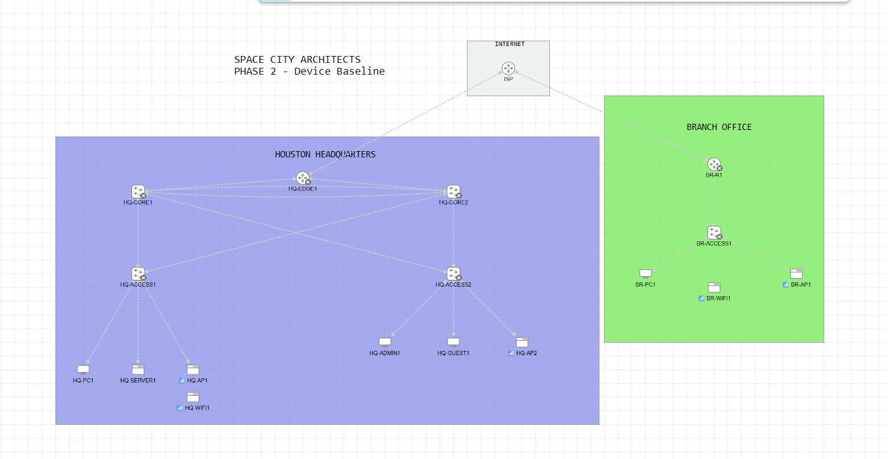
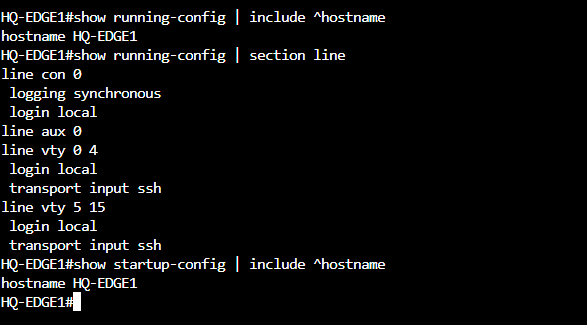
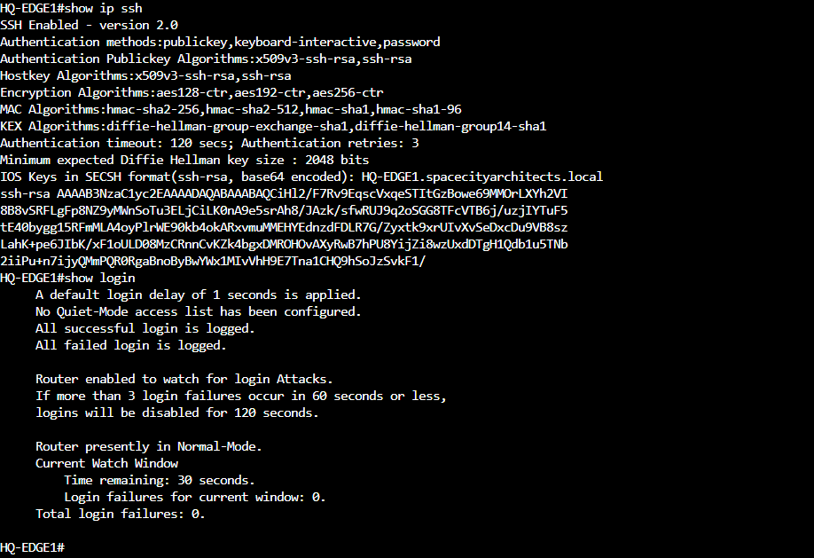

# Phase 2 MOP — Device Baseline and Secure Administrative Access

| Field | Value |
| --- | --- |
| Project | Space City Architects Enterprise Network Lab |
| Document ID | SCA-CML-P2-001 |
| Platform | Cisco Modeling Labs 2.10 |
| Phase | 2 — Device Baseline and Secure Administrative Access |
| Status | Complete |
| Completion date | August 18, 2026 |
| Change type | Lab configuration; no production impact |

## 1. Purpose

This Method of Procedure (MOP) records the standardized administrative baseline applied to the Space City Architects-managed routers and switches. The work establishes consistent device identity, secure local authentication, SSH capability, console and VTY controls, login-attempt protection, and persistent configuration before network services are introduced.

Phase 2 deliberately separates device administration from logical network implementation. No management IP address or user traffic path exists at this milestone, so SSH is validated locally as a configured service rather than through an end-to-end remote session.

## 2. Scope

### In scope

- Configure the seven Space City Architects-managed infrastructure devices.
- Apply the approved device hostname to each IOS configuration.
- Create a local privilege level 15 administrator.
- Protect privileged EXEC mode with an enable secret.
- Use local authentication on console and VTY lines.
- Restrict VTY access to SSH.
- Generate a 2048-bit RSA key and enable SSH version 2.
- Apply console logging, session timeout, login-attempt blocking, and login-event logging.
- Apply an authorized-use message-of-the-day banner.
- Save and verify each startup configuration.

### Out of scope

- Configuration of the simulated `ISP` router as an enterprise-managed device.
- Management VLANs or management IP addressing.
- Data, server, administration, guest, voice, or wireless VLANs.
- Access ports, 802.1Q trunks, native VLANs, or allowed VLAN lists.
- LACP EtherChannel or spanning-tree tuning.
- Switched virtual interfaces, inter-VLAN routing, or HSRP.
- WAN addressing, static routes, or OSPF.
- DHCP, NAT/PAT, ACLs, SSIDs, or wireless client association.
- End-to-end SSH testing.

These features are assigned to later phases so that each change set can be implemented and validated independently.

## 3. Administrative boundary

The `ISP` node represents an external service provider. It remains in the topology but is excluded from the Space City Architects administrative baseline. Only the interface addressing and routing behavior required to simulate provider connectivity will be added in the applicable WAN phase.

The following devices are managed by Space City Architects and were included in Phase 2:

| Device | Site | Role | Phase 2 result |
| --- | --- | --- | --- |
| `HQ-EDGE1` | Houston HQ | Enterprise WAN edge router | Pass |
| `BR-R1` | Branch | Branch edge router | Pass |
| `HQ-CORE1` | Houston HQ | Core switch 1 | Pass |
| `HQ-CORE2` | Houston HQ | Core switch 2 | Pass |
| `HQ-ACCESS1` | Houston HQ | Access switch 1 | Pass |
| `HQ-ACCESS2` | Houston HQ | Access switch 2 | Pass |
| `BR-ACCESS1` | Branch | Branch access switch | Pass |

## 4. Configuration standard

### 4.1 Lab credentials

This isolated educational lab intentionally uses `cisco` as both the local administrator name and shared lab secret. These credentials are documented for reproducibility and must never be reused in a production environment.

Production implementations should use unique credentials, centralized authentication, role-based privileges, protected secret storage, and an approved rotation policy.

### 4.2 Standard template

The following template was applied to each in-scope device. `<HOSTNAME>` was replaced with the approved device name.

```cisco
configure terminal

hostname <HOSTNAME>
no ip domain-lookup
service password-encryption

enable secret <LAB_SECRET>
username <LOCAL_ADMIN> privilege 15 secret <LAB_SECRET>

ip domain-name spacecityarchitects.local

banner motd #AUTHORIZED ACCESS ONLY - SPACE CITY ARCHITECTS LAB#

login block-for 120 attempts 3 within 60
login on-failure log
login on-success log

line console 0
 login local
 logging synchronous
 exec-timeout 10 0
 exit

line vty 0 15
 login local
 transport input ssh
 exec-timeout 10 0
 exit

crypto key generate rsa modulus 2048
ip ssh version 2

end
copy running-config startup-config
```

`no ip domain-lookup` prevents mistyped commands from causing an unnecessary DNS lookup while no management DNS service exists. The `ip domain-name` command remains present because IOS uses the hostname and domain name when creating the RSA identity for SSH.

## 5. Pre-change checks

Before configuration began, the following conditions were confirmed:

1. Work was performed in a copy of the completed Phase 1 lab.
2. The 18-node topology and 19 wired links matched the approved Phase 1 interface map.
3. No production addressing, VLAN, trunk, routing, or service configuration existed.
4. Infrastructure devices retained their documented IOSv or IOSvL2 node definitions.
5. Devices were configured one at a time to keep the unconfigured Layer 2 topology controlled.
6. The Phase 1 milestone remained available as the rollback point.

## 6. Implementation procedure

The baseline was applied in the following order:

1. Started `HQ-EDGE1` and opened its console.
2. Applied the standard configuration using hostname `HQ-EDGE1`.
3. Generated the RSA key, enabled SSH version 2, saved the configuration, and captured representative evidence.
4. Repeated the approved baseline for `BR-R1`.
5. Repeated the approved baseline for `HQ-CORE1` and `HQ-CORE2`.
6. Repeated the approved baseline for `HQ-ACCESS1` and `HQ-ACCESS2`.
7. Repeated the approved baseline for `BR-ACCESS1`.
8. Verified each running hostname, startup hostname, and local SSH service.
9. Stopped the lab nodes after validation.
10. Left the `ISP`, endpoints, server, access points, and wireless clients unchanged.

## 7. Verification

### 7.1 Commands

The following non-disruptive commands were used to validate the baseline:

```cisco
show ip ssh
show login
show running-config | include ^hostname
show running-config | section line
show startup-config | include ^hostname
```

### 7.2 Acceptance criteria

| Check | Expected result | Result |
| --- | --- | --- |
| Device identity | Running hostname matches the CML node name | Pass |
| Local administration | Privilege level 15 local administrator exists | Pass |
| Privileged mode | Enable secret is configured | Pass |
| Console access | Console uses local authentication and synchronous logging | Pass |
| VTY access | VTY lines 0–15 use local authentication | Pass |
| Remote protocol | VTY accepts SSH and does not accept Telnet | Pass |
| SSH service | SSH version 2 is enabled | Pass |
| Cryptographic identity | 2048-bit RSA key exists | Pass |
| Login protection | Three failures within 60 seconds trigger a 120-second block | Pass |
| Audit logging | Successful and failed login events are logged | Pass |
| Persistence | Startup hostname matches the running hostname | Pass |
| Scope control | No Phase 3–5 network features were introduced | Pass |

Remote SSH reachability is not an acceptance criterion for Phase 2 because the devices do not yet have management addresses. That test will be added after management VLAN and addressing implementation.

## 8. Evidence

### Phase 2 milestone topology

The physical topology is unchanged from Phase 1. The milestone image records the completed device-baseline phase.



### Console and VTY controls

The representative `HQ-EDGE1` output confirms the running and startup hostnames and shows local authentication with SSH-only VTY access. Credential hashes are intentionally excluded from the published evidence.



### SSH and login controls

The representative `HQ-EDGE1` output confirms SSH version 2, the minimum 2048-bit Diffie-Hellman requirement, successful and failed login logging, and the configured login-blocking policy. The displayed RSA material is the public key, not the private key.



One representative evidence set is used because the same approved baseline and verification process were applied to all seven enterprise-managed devices. Device-specific results are recorded in Section 3.

## 9. Rollback

The preferred rollback is to stop the Phase 2 lab and reopen the preserved Phase 1 topology-only milestone. This returns the project to the last approved state without altering the Phase 1 evidence.

If correcting a single device within the Phase 2 copy:

1. Keep the affected device isolated from further changes.
2. Compare its running configuration with the standard template.
3. Remove or correct only the nonconforming baseline command.
4. Save the corrected configuration.
5. Repeat the verification commands in Section 7.
6. Record the correction in the execution journal or commit history.

## 10. Security considerations

- The credentials are intentionally weak and limited to this isolated educational lab.
- No real organizational names, credentials, IP addresses, API tokens, or private keys are used.
- Screenshots omit the stored credential hash.
- The RSA private key is not exported or committed.
- `service password-encryption` is included as an IOS baseline control but is not a substitute for modern secret storage or centralized authentication.
- Management-plane hardening will be revisited after management reachability exists.

## 11. Phase 2 completion statement

All seven Space City Architects-managed infrastructure devices now have standardized identity, secure local authentication, SSH version 2 capability, protected console and VTY access, login-attempt controls, and persistent startup configurations. The simulated `ISP` remains outside the enterprise administrative boundary. No management addressing, VLAN, trunking, EtherChannel, routing, or network service configuration was introduced.

## 12. Handoff to Phase 3

Phase 3 will define and implement the Layer 2 campus foundation: VLANs, management addressing, 802.1Q trunks, the LACP core EtherChannel, and spanning-tree tuning. It will also introduce the first remote SSH reachability test over the management network. Addressing and VLAN identifiers must be documented and approved before configuration begins.
