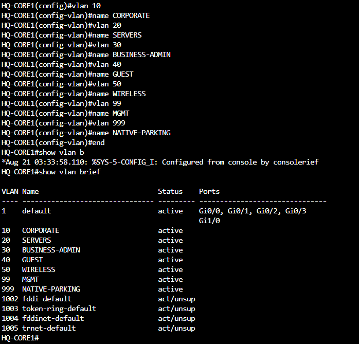
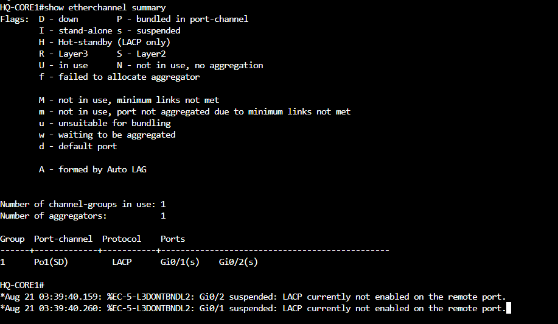
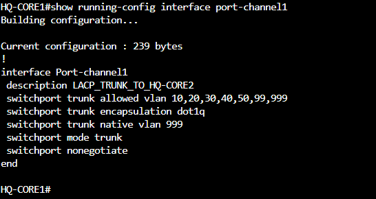

# Phase 3 MOP — Layer 2 Campus Foundation

| Field | Value |
| --- | --- |
| Project | Space City Architects Enterprise Network Lab |
| Document ID | SCA-CML-P3-001 |
| Platform | Cisco Modeling Labs 2.10 |
| Phase | 3 — Layer 2 Campus Foundation |
| Status | In progress |
| Start date | August 20, 2026 |
| Change type | Lab configuration; no production impact |

## 1. Purpose

This Method of Procedure documents the design and staged implementation of the Space City Architects Layer 2 campus foundation. Phase 3 introduces VLAN segmentation, switch management addressing, manually defined 802.1Q trunks, an LACP core EtherChannel, and deterministic Rapid PVST+ root placement.

Phase 3 remains separate from inter-VLAN routing, HSRP, WAN addressing, OSPF, DHCP, NAT/PAT, ACLs, and wireless services. Those functions remain assigned to later phases.

## 2. Current checkpoint

Phase 3 is **in progress**. As of August 22, 2026, the headquarters Layer 2 campus implementation and management-plane validation are complete. `HQ-CORE1`, `HQ-CORE2`, `HQ-ACCESS1`, and `HQ-ACCESS2` are configured and saved, and `HQ-ADMIN1` has successfully reached all four switch management interfaces by ping and SSH. Branch implementation, the `HQ-EDGE1` baseline, final configuration extraction, test import, and completion evidence remain pending.

The Phase 3 copy was imported from the Phase 2 topology export, but the device configurations were not embedded in that YAML because the running configurations had not first been extracted into the CML lab definition. The Phase 2 configurations remained recoverable in the original lab. For the Phase 3 copy, the administrative baseline is being rebuilt as each device is configured.

| Device | Phase 3 status | Notes |
| --- | --- | --- |
| `HQ-CORE1` | Configured | VLANs, STP roles, LACP, trunks, management SVI, CDP, and startup configuration completed |
| `HQ-CORE2` | Configured | Complementary STP roles, operational LACP EtherChannel, restricted trunks, management SVI, CDP, SSH, and startup configuration completed |
| `HQ-ACCESS1` | Configured | Corporate, server, wireless, and management access completed; Rapid PVST+ forwarding and alternate paths verified |
| `HQ-ACCESS2` | Configured | Business administration, guest, wireless, and management access completed; per-VLAN STP load distribution verified |
| `HQ-ADMIN1` | Configured | `10.10.99.50/24` assigned on `eth0`; persistent Alpine network and hostname files written; ping and SSH validation passed |
| `BR-R1` | Pending | Administrative baseline and Layer 1 preparation only; routing remains deferred |
| `BR-ACCESS1` | Pending | Branch VLANs, router trunk, endpoint ports, and management SVI |
| `HQ-EDGE1` | Pending | Administrative baseline only; core-facing routed links remain untouched |

## 3. Scope

### In scope

- Reapply the approved Phase 2 administrative baseline where required by the imported copy.
- Create the approved VLANs manually; VTP is not used.
- Configure switch management SVIs and addresses.
- Configure endpoint-facing access ports.
- Configure static 802.1Q trunks with explicit allowed VLAN lists.
- Use VLAN 999 as the unused native and parking VLAN.
- Bundle the two core links into one LACP EtherChannel.
- Configure Rapid PVST+ and deterministic root roles.
- Enable CDP on trusted infrastructure links for neighbor validation.
- Validate VLAN consistency, trunks, EtherChannel, spanning tree, management reachability, and SSH.
- Save, extract, verify, and test-import the final CML milestone.

### Out of scope

- Configuration of the simulated `ISP` as an enterprise-managed device.
- Inter-VLAN routing or switched virtual interfaces acting as user gateways.
- HSRP, WAN addressing, static routing, or OSPF.
- DHCP, NAT/PAT, ACLs, SSIDs, or wireless client association.
- Layer 3 configuration of the HQ edge-to-core links.
- Public distribution of a CML YAML containing credential hashes or cryptographic material.

## 4. Approved VLAN design

The same functional VLAN IDs are used at both sites, but the sites remain separate Layer 2 domains and use different IPv4 subnets.

| VLAN | Name | Purpose | HQ | Branch |
| ---: | --- | --- | :---: | :---: |
| 10 | `CORPORATE` | Standard employee workstations | Yes | Yes |
| 20 | `SERVERS` | Application and server systems | Yes | No |
| 30 | `BUSINESS-ADMIN` | Business administration users | Yes | No |
| 40 | `GUEST` | Untrusted guest endpoints | Yes | No |
| 50 | `WIRELESS` | AP wired connectivity and later wireless clients | Yes | Yes |
| 99 | `MGMT` | Switch management and SSH access | Yes | Yes |
| 999 | `NATIVE-PARKING` | Unused native VLAN and disabled ports | Yes | Yes |

VLAN 1 is not used for user traffic, infrastructure management, or the native VLAN. VLAN 999 has no Layer 3 subnet or gateway.

## 5. IPv4 addressing plan

The site blocks provide simple summarization and room for growth:

- Headquarters: `10.10.0.0/16`
- Branch: `10.20.0.0/16`

| VLAN | HQ subnet | Branch subnet |
| ---: | --- | --- |
| 10 Corporate | `10.10.10.0/24` | `10.20.10.0/24` |
| 20 Servers | `10.10.20.0/24` | Not used |
| 30 Business Admin | `10.10.30.0/24` | Not used |
| 40 Guest | `10.10.40.0/24` | Not used |
| 50 Wireless | `10.10.50.0/24` | `10.20.50.0/24` |
| 99 Management | `10.10.99.0/24` | `10.20.99.0/24` |
| 999 Native/Parking | No subnet | No subnet |

### 5.1 Reserved addressing convention

| Range | Planned use |
| --- | --- |
| `.1` | Future HSRP VIP or branch router gateway |
| `.2–.9` | Core or router infrastructure |
| `.10–.29` | Access switches and other network infrastructure |
| `.50–.99` | Static servers or administrative systems |
| `.100–.199` | Future DHCP clients |
| `.200–.254` | Expansion and testing |

### 5.2 Management addresses

| Device | Address | Status |
| --- | --- | --- |
| `HQ-CORE1` | `10.10.99.2/24` | Configured; SVI observed up/up |
| `HQ-CORE2` | `10.10.99.3/24` | Configured; SVI observed up/up |
| `HQ-ACCESS1` | `10.10.99.11/24` | Configured; SVI observed up/up |
| `HQ-ACCESS2` | `10.10.99.12/24` | Configured; SVI observed up/up |
| `HQ-ADMIN1` | `10.10.99.50/24` | Configured; all four HQ switch management addresses reachable |
| Future branch gateway | `10.20.99.1/24` | Reserved for Phase 4 |
| `BR-ACCESS1` | `10.20.99.11/24` | Pending |

No management default gateway is introduced in this checkpoint. The first HQ management tests remain inside `10.10.99.0/24`.

## 6. Approved Layer 2 design

### 6.1 Core EtherChannel

| Item | Design |
| --- | --- |
| Member links | `HQ-CORE1 G0/1–2` to `HQ-CORE2 G0/1–2` |
| Protocol | LACP |
| Mode | Active on both cores |
| Logical interface | `Port-channel1` |
| Trunk encapsulation | IEEE 802.1Q |
| Allowed VLANs | `10,20,30,40,50,99,999` |
| Native VLAN | 999 |
| DTP | Disabled with static trunking |

The two physical links are treated as one logical STP path. The initial Core 1 suspended-member state cleared after matching LACP configuration was applied to Core 2. `Port-channel1` is now operational as a Layer 2 EtherChannel, and both `G0/1` and `G0/2` are bundled members.

### 6.2 HQ access trunks

| Access switch | Links | Allowed VLANs | Native |
| --- | --- | --- | ---: |
| `HQ-ACCESS1` | One independent trunk to each core | `10,20,50,99,999` | 999 |
| `HQ-ACCESS2` | One independent trunk to each core | `30,40,50,99,999` | 999 |

The dual-homed access-switch links do not form cross-switch EtherChannels. Rapid PVST+ will control the redundant paths on a per-VLAN basis.

### 6.3 Branch trunk

`BR-ACCESS1 G0/0` will be a static 802.1Q trunk allowing VLANs `10,50,99,999`, with VLAN 999 native. This prepares the link for router-on-a-stick in Phase 4 without introducing router subinterfaces during Phase 3.

### 6.4 Endpoint assignments

| Switch port | Endpoint | VLAN |
| --- | --- | ---: |
| `HQ-ACCESS1 G0/2` | `HQ-PC1` | 10 |
| `HQ-ACCESS1 G0/3` | `HQ-SERVER1` | 20 |
| `HQ-ACCESS1 G1/0` | `HQ-AP1` | 50 |
| `HQ-ACCESS2 G0/2` | `HQ-ADMIN1` | 99 |
| `HQ-ACCESS2 G0/3` | `HQ-GUEST1` | 40 |
| `HQ-ACCESS2 G1/0` | `HQ-AP2` | 50 |
| `BR-ACCESS1 G0/1` | `BR-PC1` | 10 |
| `BR-ACCESS1 G0/2` | `BR-AP1` | 50 |

AP connections remain ordinary access ports in VLAN 50. Multiple SSIDs, VLAN tagging at the AP, and radio association remain deferred to the wireless phase.

## 7. Spanning-tree design

Rapid PVST+ is used so each VLAN receives its own loop-free topology.

| VLANs | HQ root primary | HQ root secondary |
| --- | --- | --- |
| 10, 20, 50, 99, 999 | `HQ-CORE1` at priority 24576 | `HQ-CORE2` at priority 28672 |
| 30, 40 | `HQ-CORE2` at priority 24576 | `HQ-CORE1` at priority 28672 |

This distributes root ownership between the cores. Phase 4 should align each VLAN's future HSRP active gateway with its STP root.

`BR-ACCESS1` will be the deterministic root for its local VLANs because it is the only branch switch. PortFast and BPDU Guard will be limited to endpoint-facing access ports.

## 8. HQ implementation record

### 8.1 HQ-CORE1

The following work is complete on `HQ-CORE1`:

1. Reapplied the approved device identity, local privilege 15 administrator, enable secret, domain name, login-attempt controls, and login-event logging.
2. Generated a 2048-bit RSA key and enabled SSH version 2.
3. Restricted VTY lines to SSH with local authentication.
4. Created VLANs 10, 20, 30, 40, 50, 99, and 999.
5. Enabled Rapid PVST+ and assigned the approved root priorities.
6. Placed `G0/1` and `G0/2` in LACP channel-group 1 using active mode.
7. Configured `Port-channel1` as an 802.1Q trunk allowing every HQ VLAN, with VLAN 999 native and DTP disabled.
8. Configured `G0/3` as the restricted trunk to `HQ-ACCESS1`.
9. Configured `G1/0` as the restricted trunk to `HQ-ACCESS2`.
10. Enabled CDP globally and on trusted infrastructure links.
11. Configured management SVI `Vlan99` as `10.10.99.2/24`.
12. Configured synchronous console logging and the approved session timeout.
13. Saved the running configuration to startup configuration.
14. Left `G0/0` toward `HQ-EDGE1` outside the Phase 3 change.

Console `login local` is intentionally deferred until after portable configuration extraction. It will be restored in both the live startup configuration and the extracted node configuration before Phase 3 is marked complete.

### 8.2 August 22 HQ checkpoint

1. Configured `HQ-CORE2` with the approved administrative baseline, SSH version 2, all HQ VLANs, complementary Rapid PVST+ priorities, matching LACP active members, restricted core and access trunks, CDP, and management SVI `10.10.99.3/24`.
2. Verified `Port-channel1` as `Po1(SU)` with `G0/1(P)` and `G0/2(P)` bundled, and confirmed same-subnet management reachability between the cores.
3. Configured `HQ-ACCESS1` with VLANs 10, 20, 50, 99, and 999; endpoint PortFast and BPDU Guard; redundant restricted trunks; CDP; and management SVI `10.10.99.11/24`.
4. Verified `HQ-ACCESS1 G0/0` as root/forwarding and `G0/1` as alternate/blocking for its production VLANs. Corrected its initial classic PVST+ state to Rapid PVST+ and saved the change.
5. Configured `HQ-ACCESS2` with VLANs 30, 40, 50, 99, and 999; endpoint PortFast and BPDU Guard; redundant restricted trunks; CDP; and management SVI `10.10.99.12/24`.
6. Verified per-VLAN STP load distribution on `HQ-ACCESS2`: VLANs 30 and 40 forward toward Core 2, while VLANs 50, 99, and 999 forward toward Core 1.
7. Configured `HQ-ADMIN1` as `10.10.99.50/24` on Alpine Linux `eth0` with no default gateway, then validated ping and SSH to all four HQ switches.
8. Saved the four HQ switch running configurations to startup configuration and wrote persistent hostname and interface files on `HQ-ADMIN1`.

## 9. Current verification

| Check | Expected result | Current result |
| --- | --- | --- |
| VLAN database | Seven approved HQ VLANs exist | Pass |
| STP configuration | Rapid PVST+ and documented priorities present | Pass |
| LACP local configuration | Channel-group 1 uses LACP active | Pass |
| LACP peer formation | Members bundle after Core 2 configuration | Pass; `Po1(SU)` with both members bundled as `P` |
| Port-channel trunk | Correct allowed list and native VLAN 999 | Pass |
| Access trunks | Correct per-switch allowed lists and native VLAN 999 | Pass on both core and access sides |
| Management SVIs | All four HQ switches use their approved VLAN 99 addresses | Pass; all observed up/up |
| SSH service | SSH version 2 enabled | Pass on all four HQ switches |
| Startup persistence | Running configuration saved | Pass on all four HQ switches |
| End-to-end management reachability | Ping and SSH from `HQ-ADMIN1` | Pass to `10.10.99.2`, `.3`, `.11`, and `.12` |
| Redundant-path STP behavior | Correct forwarding and alternate ports | Pass; root roles and per-VLAN load distribution verified |

### 9.1 HQ-ADMIN1 SSH compatibility note

The Alpine OpenSSH client rejects the legacy SHA-1 key-exchange and RSA host-key algorithms offered by the IOSvL2 15.2 image by default. Management validation used a per-connection lab-only override:

```bash
ssh -oKexAlgorithms=+diffie-hellman-group14-sha1 -oHostKeyAlgorithms=+ssh-rsa cisco@<management-ip>
```

The override was not enabled globally. Production equipment should use supported software and modern SSH algorithms.

## 10. Evidence

### Phase 3 topology and interface map


### HQ VLAN database



### Initial LACP checkpoint (historical)

This image records the temporary suspended-member state before Core 2 was configured. The condition has been resolved; both physical members are now bundled in operational `Port-channel1`.



### Core port-channel trunk



### Management SVI


## 11. Remaining implementation order

1. Prepare `BR-R1 G0/1` at Layer 1 only if required to bring up the branch trunk; routing and subinterfaces remain deferred.
2. Configure and validate `BR-ACCESS1`, including branch VLANs, endpoint ports, router trunk, Rapid PVST+, management SVI, and CDP.
3. Reapply the administrative baseline to `HQ-EDGE1` without configuring its routed links.
4. Complete full VLAN, trunk, EtherChannel, STP, CDP, management, and startup-configuration validation.
5. Extract and verify device configurations, restore console `login local`, test-import the final CML milestone, capture final evidence, and change this document's status to Complete.

## 12. Configuration extraction and export control

Before downloading the final Phase 3 YAML:

1. Confirm that every device has a saved startup configuration.
2. Temporarily remove console `login local` from the running configuration only so CML's extraction automation can access the console.
3. Close interactive console sessions.
4. Extract one device at a time and verify the result in its Config tab.
5. Restore console `login local` on the live device and save the startup configuration.
6. Add `login local` to the extracted console-line configuration and save the Config tab.
7. Download the lab and import it as a separate test copy.
8. Verify hostnames, VLANs, trunks, STP settings, management addresses, and SSH prerequisites in the imported copy.
9. Regenerate RSA keys after import if the virtual key material is not retained.
10. Keep the configured YAML private unless secrets and cryptographic material are sanitized.

## 13. Rollback

The preserved Phase 2 lab remains the approved rollback point until Phase 3 is complete.

For a single-device correction:

1. Stop additional changes to the affected device.
2. Compare its running configuration with this MOP.
3. Remove or correct only the nonconforming Phase 3 command.
4. Save the corrected configuration.
5. Repeat the applicable verification checks.
6. Record the correction in this document or the commit history.

## 14. Completion criteria

Phase 3 will be marked Complete only after:

- All required VLANs exist on the correct switches.
- Every access port and trunk matches the approved port map.
- Both core links bundle in LACP `Port-channel1`.
- Rapid PVST+ selects the intended primary and secondary roots.
- Redundant access paths show the expected forwarding and alternate states.
- All switch management SVIs are operational.
- `HQ-ADMIN1` can ping and SSH to all four HQ switches.
- Configurations are saved, extracted, test-imported, and verified.
- Final evidence replaces or supplements the current checkpoint evidence.
